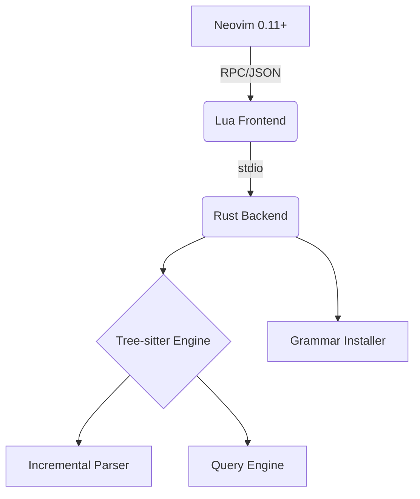

# Xylem: Incremental Parser for Neovim 0.11+

Xylem is a high-performance, Rust-powered incremental parser for Neovim. It offloads heavy Tree-sitter analysis and query execution to a dedicated Rust process, ensuring the main Neovim thread remains responsive even during complex syntax highlighting and analysis tasks.

## Key Features

- **🚀 Rust-Powered Performance:** Core parsing and query logic implemented in Rust for maximum efficiency.
- **🔄 True Incrementalism:** Uses Tree-sitter's incremental parsing to only update what has changed.
- **📡 Async RPC Bridge:** Communicates via a low-latency JSON RPC protocol over standard streams.
- **📦 Automated Grammar Management:** Integrated async installer that replaces standard `nvim-treesitter` workflows.
- **🧩 Minimal Neovim Footprint:** A slim Lua plugin handles the frontend, while Rust handles the heavy lifting.

---

## Architecture

Xylem operates as a bridge between Neovim and the Tree-sitter ecosystem:



The Rust backend manages the document state using efficient data structures (like ropes) and performs asynchronous query execution, sending results back to Neovim for rendering via extmarks.

---

## Getting Started

### Prerequisites

- **Neovim 0.11+** (Nightly or stable release)
- **Rust Toolchain** (Stable)

### Installation

Using [lazy.nvim](https://github.com/folke/lazy.nvim):

```lua
return {
    "arancamon/xylem", -- Or your local path
    build = "cargo build --release",
    config = function()
        require("xylem").start()
    end,
}
```

### Manual Build
If you are developing or prefer a manual build:
```bash
cargo build --release
```
The plugin expects the binary to be at `./target/release/xylem`.

---

## Grammar and Query Management

Xylem includes a built-in management system for Tree-sitter grammars and queries. It provides several commands for installation and synchronization:

- `:XylemInstall <lang>`: Install a specific grammar.
- `:XylemSync`: Perform a bulk synchronization of supported grammars.
- `:XylemInfo`: View backend status and active buffers.

For detailed command usage and technical details, see the [Command and Grammar Reference](docs/COMMAND-REFERENCE.md).

---

## Project Structure

- `src/`: Rust backend implementation (RPC server, parser, runtime).
- `lua/xylem/`: Neovim Lua plugin (initialization, RPC utilities, highlights).
- `queries/`: Tree-sitter query files (`.scm`) for supported languages.
- `docs/`: In-depth documentation and technical specifications.

---

## Roadmap

- [x] Basic incremental parsing
- [x] Async Grammar Installer
- [x] Basic syntax highlighting
- [ ] Full `InputEdit` position synchronization
- [ ] Advanced query result caching
- [ ] Extmark-based highlight rendering
- [ ] File monitoring for query auto-reloading

---

## License

This project is licensed under the MIT License - see the [LICENSE](LICENSE) file for details.
